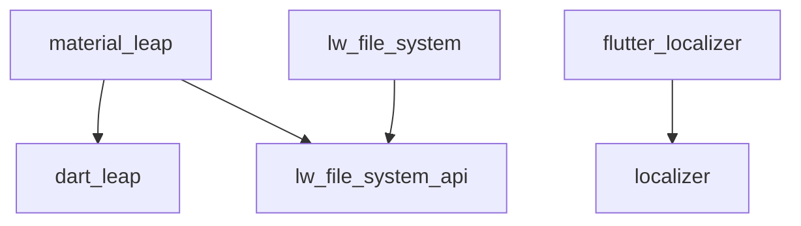

# Linwood Flutter Plugins

This monorepo contains a set of reusable Dart & Flutter libraries focused on productivity, localization, networking, system access, file systems, and console tooling.  
Use the packages individually via git dependencies.

## Packages

- [localizer](packages/localizer) - Easy localization framework (Dart)
- [flutter_localizer](packages/flutter_localizer) - Flutter localization framework based on localizer (Flutter)
- [networker](packages/networker) - Universal networking library (Dart). Contains multiple packages with support for multiple features and protocols
- [lw_sysapi](packages/lw_sysapi) - System information & platform APIs (Flutter)
- [dart_leap](packages/dart_leap) - General helper utilities (Dart)
- [material_leap](packages/material_leap) - Extra Material widgets & helpers (Flutter)
- [generate_leap](packages/generate_leap) - Generation helper utilities (Dart)
- [lw_file_system](packages/lw_file_system) - Cross‑platform file system abstraction (Flutter)
- [lw_file_system_api](packages/lw_file_system_api) - Pure Dart API for lw_file_system
- [consoler](packages/consoler) - Console helpers & structured output (Dart)

Each package has its own README with more detailed usage.

## Inter-Package Graph

Below are direct internal dependencies (only showing notable links):



Keep commit refs for these pairs synchronized with the versions declared in each package's pubspec.yaml.

## Git Dependency Examples

Minimal (not recommended for production):

```yaml
some_package:
  git:
    url: https://github.com/<your-org-or-user>/dart_pkgs.git
    path: packages/some_package
```

Pinned (recommended):

```yaml
some_package:
  git:
    url: https://github.com/<your-org-or-user>/dart_pkgs.git
    path: packages/some_package
    ref: <commit-hash>
```

Read more about [using git dependencies in the dart documentation](https://dart.dev/tools/pub/dependencies#git-packages).

## License

All packages are licensed under Apache 2.0.  
See the root [LICENSE](LICENSE) file for details.

---
Happy building!
